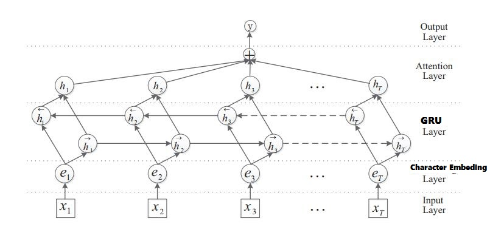
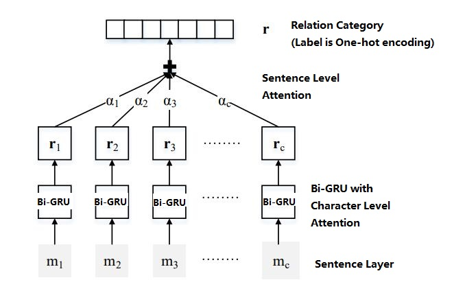

Problem solving consideration process:
===

###First: Briefly understand
The first time I got this exam, I must understand the EER and NER 
technology. I read some paper about the technology (because I have 
not have much exposure to NLP).

[Bidirectional Encoder Representation from Transformers](https://arxiv.org/pdf/1810.04805.pdf)

[Bilateral Multi-Perspective Matching for Natural Language Sentences](https://arxiv.org/pdf/1702.03814.pdf)

[Improving Language Understanding by Generative Pre-Training](https://www.cs.ubc.ca/~amuham01/LING530/papers/radford2018improving.pdf)

###Second: Training & Test
Find related codes and models according to the requirements of the company.

[NER](https://github.com/Determined22/zh-NER-TF)

[EER](https://github.com/crownpku/Information-Extraction-Chinese/tree/master/RE_BGRU_2ATT)

Configure the code and complete the result recording.

####Third: What I do
I determined the version of the tool library according to code, 
and ruled out some problems (due to the version changed some functions 
and parameters are different)

I used the provided dataset to complete the production of 
the new dataset according to the code.

###Fourth: Models and technologies introduction   
####NER

use BiLSTM + CRF

####EER

use BiGRU + Attention
###Fifth: Result analysis
NER:For topic one, due to the small number of database given, I just get a 
model that perform well on the trainning dataset. When I used 100% for trainning,
and 20% for testing, I got the ap 90.72%. As a comparsion I used 80% for 
traning and 20% for testing, I got the ap about 27.93%.

EER:For topic two, I can just run traing and testing codes, the database is
provided by a relationship classification match, so I can not training enough
epochs by using CPU.

Detailed results and configuration please watch in the folders 'EER'','NER' -- INSTALL.md file.
###Sixth: Future directions for improvement (What I want to do)
I consider that NLP use LSTM(or GRU) technology, so we can add an attention
 mechanism for getting more semantic information. Because in the process,
 the information is getting less and less, we should try the best to get more
 semantic information. This is a sample method, a very clever idea.

one. Using BiLSTM to BiGRU 

two. Change attention layer: [Attention](https://arxiv.org/pdf/1709.01507.pdf)

three. Consider unsupervised learning (using the classification model directly)

###Seven: The question of provided code

For code one [one](https://github.com/NLP-LOVE/Introduction-NLP/blob/master/code/ch08/crf_ner.py)
This code is basing on PKU corpus

For code two [two](https://www.kaggle.com/williamroe/bi-lstm-with-crf-for-ner)
This code is an complete system, only using NER section will change many codes
and should change some code to make this code apply in zh-cn

Considering time and complexity, I use two different code sources.